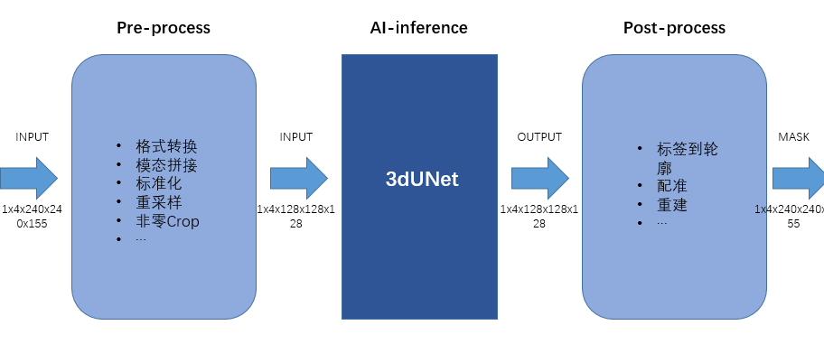
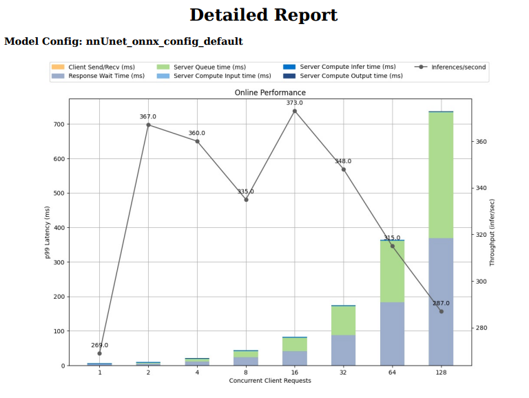
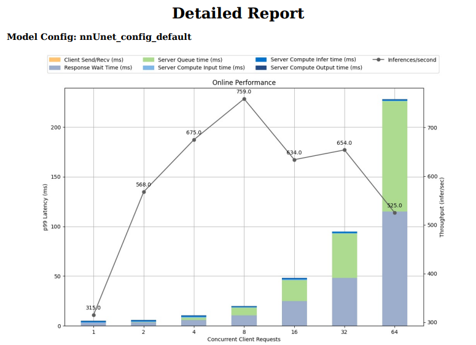
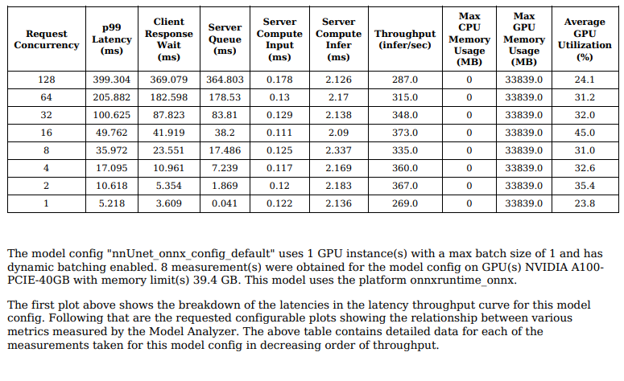
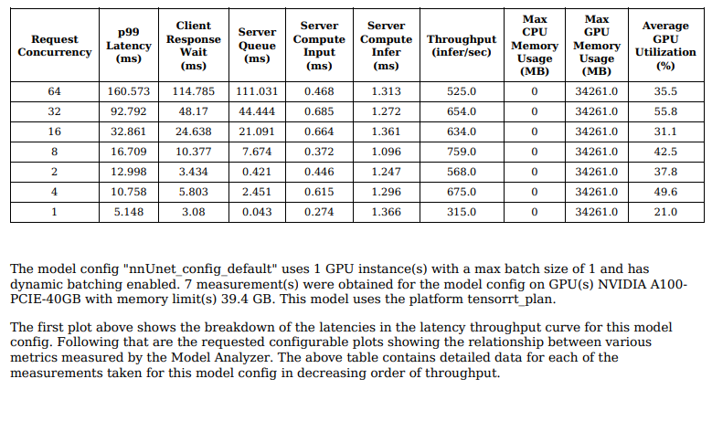

# TensorRT推理服务化加速
一个完整的医疗影像推理流程一般包含数据的前处理、AI 推理以及数据后处理这几部分。

__Triton扮演的角色__
简化深度学习推理的大规模部署,是一个兼容多种框架AI模型的部署软件。  
Triton 可提供高吞吐量推理，以实现 GPU 使用率的最大化。

__ONNX__
微软和Facebook提出用来表示深度学习模型的开放格式。
模型交换格式ONNX,特点是部署时框架兼容，跨平台

##  TensorRT
只负责模型的推理（inference）过程，一般不用TensorRT来训练模型。

## 加速原理
1. 推理精度可选
   
2. 对网络结构重构，将运算合并，针对具体型号的GPU硬件，优选计算库中最佳算子，达到性能优化的效果，提供低延时推理。

3. 计算核心自动调整——TensorRT可以针对不同的算法，不同的网络模型，不同的GPU平台，进行 CUDA核的调整，以保证当前模型在特定平台上以最优性能计算。

## 推理加速技术路线

[Link](https://github.com/noil-lion/TRITON_LEARN/blob/main/note/Triton%E6%A8%A1%E5%9E%8B%E9%83%A8%E7%BD%B2%E4%BC%98%E5%8C%96%E6%A6%82%E8%BF%B0.md#%E6%A8%A1%E5%9E%8B%E5%AF%BC%E8%88%AA%E5%99%A8navigator)
## 模型转换原理流程
* 导出网络定义以及相关权重；
* 解析网络定义以及相关权重；
* 根据显卡算子构造出最优执行计划；
* 将执行计划序列化存储；
* 反序列化执行计划；
* 进行推理

## onnx和TensorRT推理性能对比
基于model_analyzer的不同执行计划下的模型推理性能

基于ONNX的默认配置下的推理吞吐性能报告  
  

基于TensorRT的默认配置下的推理吞吐性能报告  
  

高并发下onnx模型的GPU利用率

高并发下TensorRT的GPU利用率

