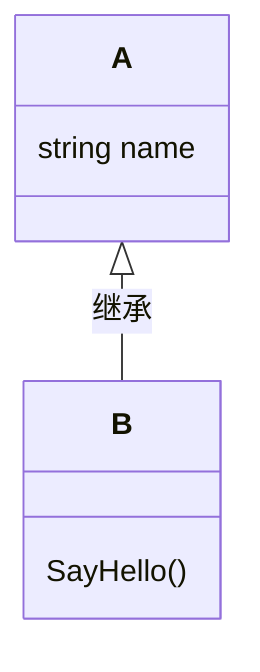
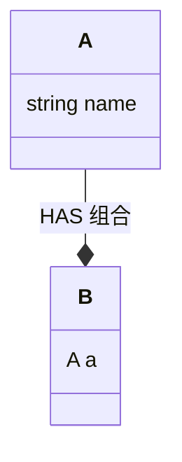
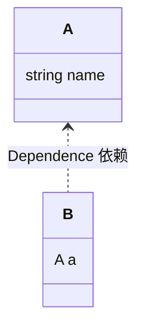
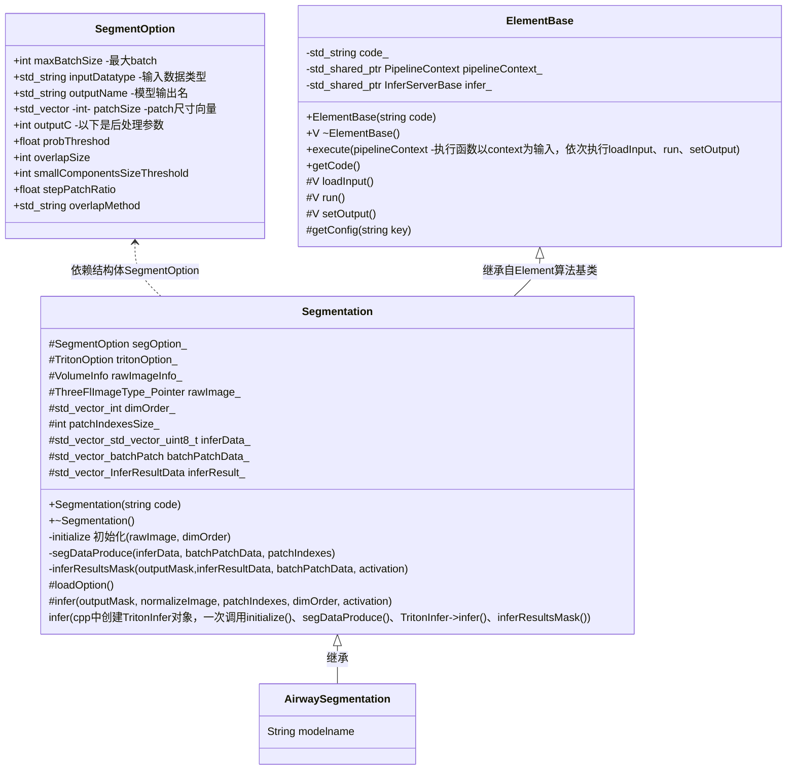

# Airway Segmentation API

## 类图关系
1. 继承（B is A）

```mermaid
classDiagram
    class A
    A:string name
    A <|-- B:继承
    B:SayHello()
```
2. 组合(B has A)

```mermaid
classDiagram
    class A
    A:string name
    A --* B: HAS 组合 
    B:A a
```  
3. 依赖（B受A的变化影响）

```mermaid
classDiagram
    class A
    A:string name
    A <.. B: Dependence 依赖
    B:A a
```

## 类图树

```mermaid
classDiagram
    class SegmentOption
    SegmentOption:+int maxBatchSize -最大batch
    SegmentOption:+std_string inputDatatype -输入数据类型
    SegmentOption:+std_string outputName -模型输出名
    SegmentOption:+std_vector -int- patchSize -patch尺寸向量

    SegmentOption:+int outputC -以下是后处理参数
    SegmentOption:+float probThreshod
    SegmentOption:+int overlapSize
    SegmentOption:+int smallComponentsSizeThreshold
    SegmentOption:+float stepPatchRatio
    SegmentOption:+std_string overlapMethod

    SegmentOption <..Segmentation :依赖结构体SegmentOption

    class ElementBase
    ElementBase :+ElementBase(string code)
    ElementBase :+V ~ElementBase()
    ElementBase :+execute(pipelineContext -执行函数以context为输入，依次执行loadInput、run、setOutput)
    ElementBase :+getCode()

    ElementBase :#V loadInput()
    ElementBase :#V run()
    ElementBase :#V setOutput()
    ElementBase :#getConfig(string key)

    ElementBase :-std_string code_
    ElementBase :-std_shared_ptr PipelineContext pipelineContext_
    ElementBase :-std_shared_ptr InferServerBase infer_
    
    ElementBase  <|-- Segmentation :继承自Element算法基类
    Segmentation 
    Segmentation : +Segmentation(string code)
    Segmentation : +~Segmentation()
    Segmentation : -initialize 初始化(rawImage, dimOrder)
    Segmentation : -segDataProduce(inferData, batchPatchData, patchIndexes)
    Segmentation : -inferResultsMask(outputMask,inferResultData, batchPatchData, activation)
    Segmentation : #loadOption()
    Segmentation : #infer(outputMask, normalizeImage, patchIndexes, dimOrder, activation) 
    Segmentation : #SegmentOption segOption_
    Segmentation : #TritonOption tritonOption_
    Segmentation : #VolumeInfo rawImageInfo_
    Segmentation : #ThreeFlImageType_Pointer rawImage_
    Segmentation : #std_vector_int dimOrder_
    Segmentation : #int patchIndexesSize_
    Segmentation : #std_vector_std_vector_uint8_t inferData_
    Segmentation : #std_vector_batchPatch batchPatchData_
    Segmentation : #std_vector_InferResultData inferResult_
    Segmentation : infer(cpp中创建TritonInfer对象，一次调用initialize()、segDataProduce()、TritonInfer->infer()、inferResultsMask())

    Segmentation <|-- AirwaySegmentation :继承

    class AirwaySegmentation
    AirwaySegmentation : String modelname
    AirwaySegmentation 
```