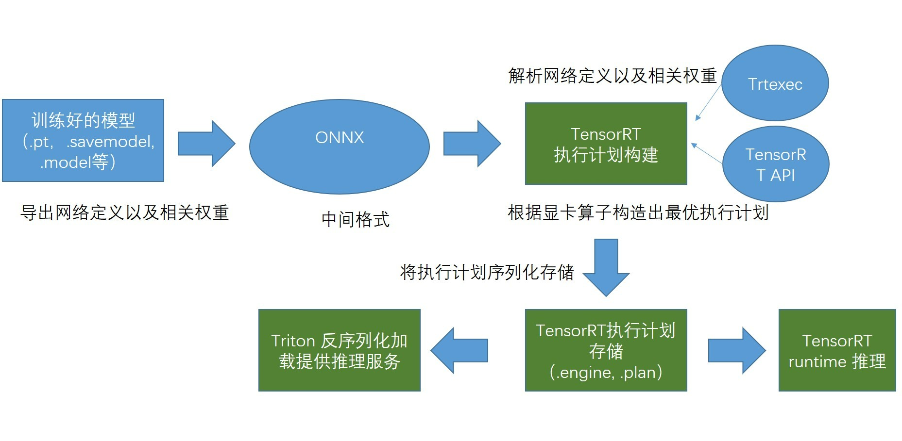
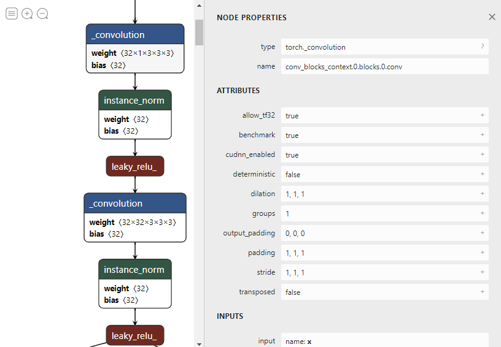
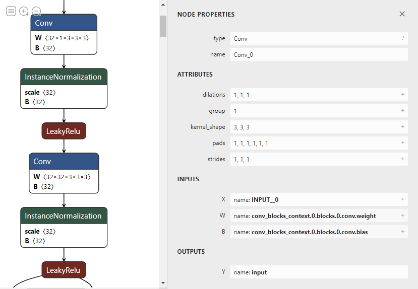
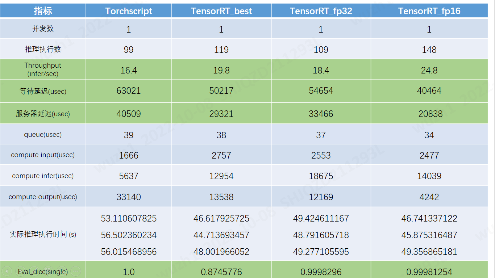
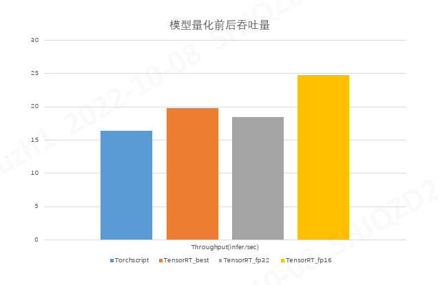
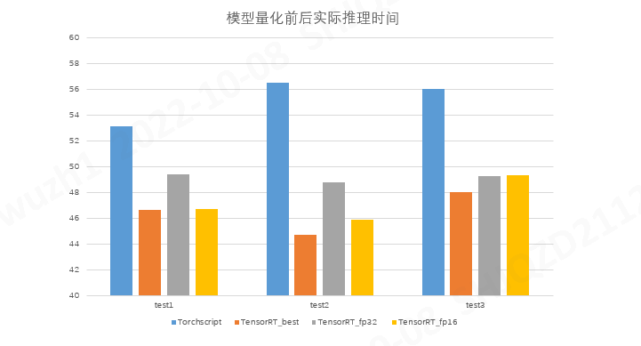
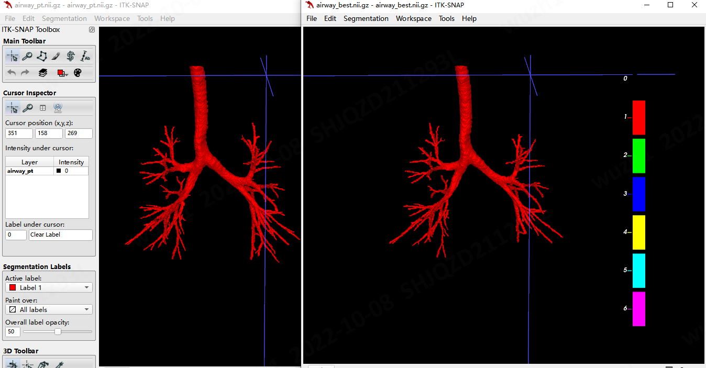
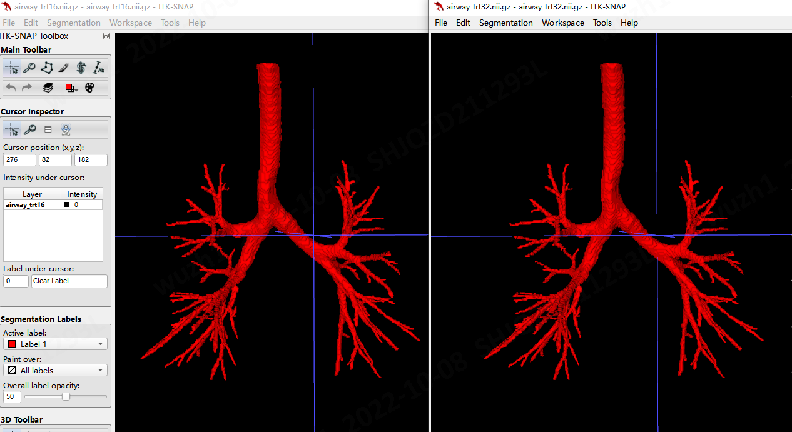

# 模型部署加速性能验证-Linux

## 推理加速技术路线

## Linux平台的模型转换和推理性能测试
1. __网络结构可视化（.pt->.onnx）__
   __Netron__:核对网络计算图，各算子的连接、属性、输入输出等 [Netron](https://netron.app/)  
    |网络|.pt|.onnx|算子支持(ATen->ONNX)|
    |:--:|:--:|:--:|:--|
    |airway|||一对一:   _convolution->Conv,instance_norm->InstanceNormalization...|

2. __推理性能测试(.pt->.engine)__
   当前实验结果均基于单卡单实例，并发请求数为1的配置前提下，
   分别基于TorchScript--Airway_pt模型；  
          TensorRT-Airway_best模型；  
          TensorRT-Airway_fp32模型；  
          TensorRT-Airway_fp16模型；
    进行性能测试和结果验证。
   
   
   

3. __推理结果可视化(.pt，.plan-best，.plan-fp32，.plan-fp16)__
   
   
   
   

## 结论
__一. 模型转换后，在面对请求并发量为1的推理请求的处理上，吞吐量最少提升20%，最多提升36%__  

__二. 在量化计算精度后，进行计算精度的调整，推理延时有了一定提升,平均最多提升8.75s，最少提升6.05s__  
