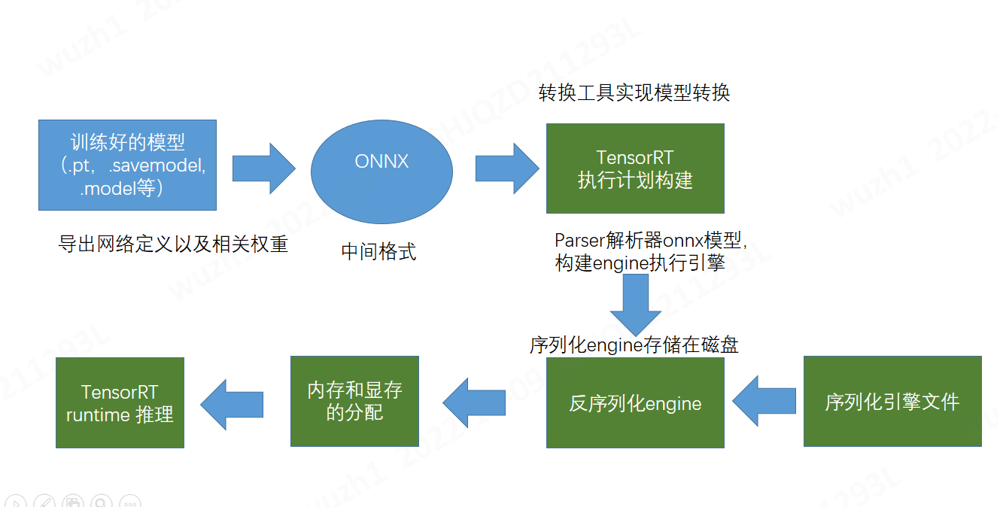
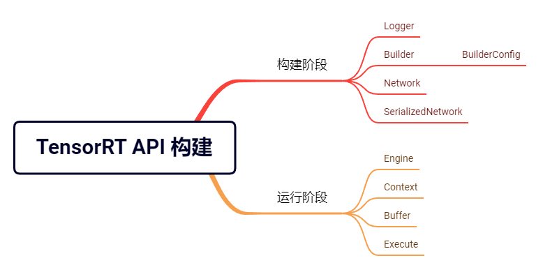
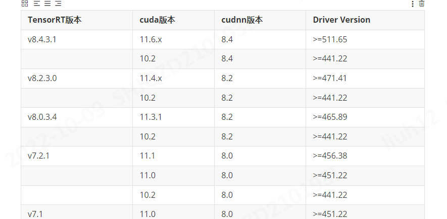
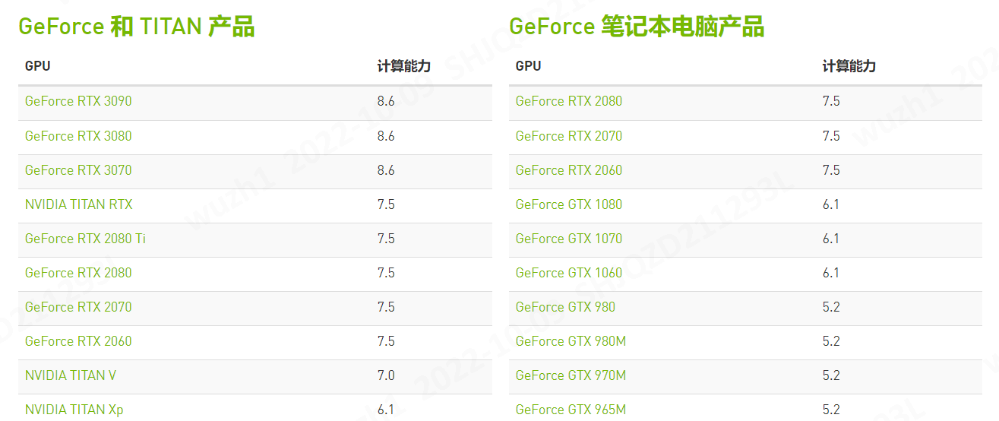

# Windows上运行深度模型推理

## 目标
1. iBotServer在Windows运行
1. 代码要兼容Linux，iBotServer能在Linux执行

## 当前情况
* iBotServer只能在Linux执行
* iBotServer当前模型是pytorch(TorchScript格式)，验证其对于TensorRT模型是否有进一步性能优化。

## 验证情况
目标：性能，质量(精度)

1. [Linux模型测试](TensorRT_Linux%E6%80%A7%E8%83%BD%E9%AA%8C%E8%AF%81.md)  
1. Windows模型测试: 待验证

## 设计
### 总体
> TensorRT是nvidia公司针对nvidia显卡训练的模型在特定平台进行加速的推理优化库，支持多维数据的推理，是一个c++库，仅支持推理，不支持训练。

### 基本流程
1. 构造阶段（模型定义和优化）   
    * 创建网络定义。  
    * 指定构建器的配置。  
    * 调用构建器来创建引擎。
1. 运行时阶段（推理）
    * 反序列化构造好的引擎的.plan。  
    * 从引擎创建执行上下文。  
    * 填充输入缓冲区以进行推理。  
    * 调用enqueue()或者execute()在执行上下文上运行推理。

### TensorRT模型转换及引擎构建
* IR 转换模型，将中间表示的模型（ONNX）转换成 TensorRT 模型，构建推理引擎。

1. Pytorch导出模型ONNX格式
2. 创建builder和网络实例
3. 解析ONNX
4. 构建engine

### TensorRT推理runtime
1. 反序列化加载引擎
1. 创建cuda流
1. 执行推理

## 环境构建
### 软硬件矩阵

[CUDA版本绑定硬件驱动](https://docs.nvidia.com/cuda/cuda-toolkit-release-notes/index.html)
[搜索GPU的驱动](https://www.nvidia.cn/download/index.aspx)
[硬件及算力](https://developer.nvidia.com/zh-cn/cuda-gpus#collapseOne/)
### 软硬件
* 硬件

| 项 | 内容 | 说明 |
| - | - | - |
| 操作系统 | Windows10企业版，64位 |  |
| GPU | GeForce RTX 3090 |   |

* 软件

| 项 | 内容 | 说明 |
| - | - | - |
|GPU Driver| 517.48| |
| CUDA | 11.6 |  |
| cuDNN | 8.4 |  |
| TensorRT GA build | 8.4.3.1 ||
| Cmake| 3.13||

### 环境安装

### 环境验证

## 长期优化
| 项 | 负责人 | 完成时间 | 说明 |
| - | - | - | - |
| 内存读写数据的POC | 刘航、吴梓皓 |  |  |
| iBotServer支持通讯用内存 | 刘航 |  |  |
| iBotServer支持通讯用内存-SDK配套 | 张亚炜 |  |  |

## 知识资料
* [TensorRT](http://10.70.21.10:8888/share/triton/-/tree/master/doc/TensorRT%E7%9F%A5%E8%AF%86%E5%BA%93%E5%BB%BA%E8%AE%BE)
* [CUDA](http://10.70.21.10:8888/share/cuda)

### TensorRT官方资料
* [安装](https://docs.nvidia.com/deeplearning/tensorrt/install-guide/index.html)
* [onnx转tensorrt engine](https://docs.nvidia.com/deeplearning/tensorrt/quick-start-guide/index.html#convert-onnx-engine)
* [c++推理tensorrt engine](https://docs.nvidia.com/deeplearning/tensorrt/quick-start-guide/index.html#run-engine-c)

## 会议纪要1
1. 整理TensorRT模型转化依赖的库，在训练环境中进行转化测试。[吴]
onnx                               1.12.0
onnxruntime                        1.12.1
NVIDIA CUDA                        11.6.2
NVIDIA cuDNN                       8.4.0.27
NVIDIA DRIVER                      510.85.02
TensorRT                           8.2.4.2
1. 性能评估表多增加一个指标。hostp[吴]
Hausdorff距离：测试
1. 当前已经完成Triton测试，后续用TensorRT测试[吴]比对执行时间
1. Linux生成模型能在相同环境的Windows使用吗？[吴]
   调研结论：TensorRT发布的模型（engine）不能跨平台使用，linux发布的模型不能在windows下用。
1. TensorRT的模型部署方式是否具备内存释放。[刘]
1. cuda、cudnn版本和GPU型号和显存的选择。[王]选硬件，高端单显卡，2块显卡
    现有笔记本Win11：3070
    要买的笔记本：3060、3070Ti。
    Linux服务器：3080Ti
    Windows10服务器：3090。
    https://item.jd.com/100032980138.html
1. TensorRT模型可执行的影响因素有哪些？显卡驱动，TensorRT[吴]
   * 需要相同GPU算力（compute capability），显卡驱动版本一致
   * 需要在使用同发布模型匹配的CUDA和cudnn环境（小版本可以上下浮动，但也会影响稳定性）
   * 需要相同版本的TensorRT版本，否则会报无法反序列化的错误
   * 需要操作系统环境一致，不可跨平台（Linux-Windows）

## 会议纪要2

1. onnx 模型在相同环境不同平台的通用性 [吴]

   结论：可以
   方案：ONNX选择使用Google的ProtoBuf，但注意需要保持ONNX版本一致。

1. win10 不同显卡转换出来的模型能不能 兼容 [吴] 

   结论 ：ONNX 可以， TensorRT不行

   方案：直接使用ONNX模型进行部署。在进行首次推理后将TensorRT的缓存保存下来，后续使用TensorRT进行推理。

   待调研：ONNX 转TensorRT 的C++脚本是否能在不同环境下成功运行。

1. 调研算法组同学是如何转化模型和使用的[刘]

   待调研，明天会议给出结论。

1. 只使用TensorRT进行推理。

   windows环境 ：依赖于[刘]Windows下TensorRT的运行

   liunx环境：  [吴]装linux的测试环境

## 会议纪要3
已完成的事情：

1. ONNX转TensorRT的C++脚本能够在不同环境下运行 [吴]。

1. 已跟算法那边沟通方案：第一次部署用ONNX模型 后续用Engine。

1. 已确定TensorRT在执行完推理后会释放模型。

进行中：

1. liunx测试环境的搭建[吴]

1. TensorRT在windows环境下的运行[刘]

1. windows服务器向日葵安装[优先级最高]

1. Airway 模型TensorRT成功进行推理  

   