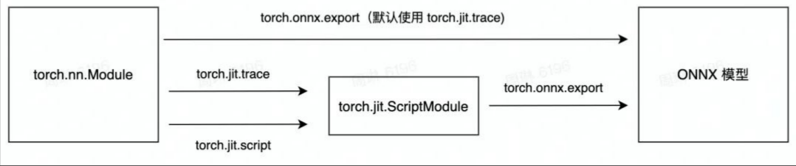

# 模型转化中间-ONNX（Open Neural Network Exchange）
部署应用时深度模型转换的中间形式，可作为多类型模型的转化管道。

## ONNX
通常Pytroch模型保存为model.pt，二进制的权重文件，torch支持将.pt转为onnx格式导出，其包含权重值和网络结构信息（数据流向、每层的输入输出...）及辅助信息。


## ONNX的读写接口-Protobuf
ONNX采用protobuf序列化数据结构协议来存储神经网络的权重信息。  

Protobuf是一种与平台无关、语言无关、可扩展的高效序列化数据结构的协议。   

可以用于网络通信和数据存储。一般采用C++接口进行读写。  

## 工作流程
通过跟踪track神经网络的计算生成，创建一个通用的计算图。  
ONNX提供了计算图模型、内部运算器、标准数据类型定义。
计算图的构建流程：
* 计算数据流图以节点列表的形式组织起来，构成一个非循环的图结构
* 每个节点由一个或多个输入输出，节点会对运算器进行调用
* 运算器在图的外部实现，也就是在支持ONNX的深度框架提供运算器的具体实现。

## Torch模型保存
常用的保存方式是torch.save(model.state_dict(),"./model_name.pth"),这种方式依赖python环境，无法独立和通用。
部署场景下，一般采用Troch.jit保存为Torchscript格式，可以与Torch C++接口通用.
1. torch.jit.trace  
这种方式为追踪一个函数的执行流，使用时需要提供一个测试输入。
注意: 这个接口只追踪测试输入走过的函数执行流,多分支的模型不要采用这种方式.
2. torch.jit.script  
使用这种方式可以将一个模型完整的保存下来，和上面的trace正好相对。如果模型中的分支很多，并且在运行时会改变的话一定要用这种形式保存。
```

store = torch.jit.trace(model,torch.randn(1,2,3,dtype=torch.float32))
store  = torch.jit.script(model)
torch.jit.save(store,"./model_name.pth")
torch.jit.load("./model_name.pth")

```
__注: .pt, .pth, .pkl的pytorch模型文件, 他们之间其实没有任何区别__
## Torch导出ONNX
```
model = test_model()           # 模型结构实例化
state = torch.load('test.pth') 
model.load_state_dict(state['model'], strict=True)  # 模型权重加载

example = torch.rand(1, 3, 128, 128)                # 输入数据维度及实例

torch_out = torch.onnx.export(model,                # 模型结构
                            example,                # 输入
                            "test.onnx",            # 导出文件名称格式
                            verbose=True,           # 打印文件信息
                            export_params=True      # True表示连带参数一起导出
                            )
```

```
def torch2onnx(model_version_dir, max_batch):
    # 定义输入的格式
    example_input0 = torch.zeros([max_batch, 2], dtype=torch.float32)
    example_input1 = torch.zeros([max_batch, 2], dtype=torch.int32)

    my_model = MyNet()

    try:
        os.makedirs(model_version_dir)
    except OSError as ex:
        pass  # ignore existing dir

    torch.onnx.export(my_model,
                      (example_input0, example_input1),
                      os.path.join(model_version_dir, 'model.onnx'),
                      # 输入节点的名称
                      input_names=("INPUT0", "INPUT1"),
                      # 输出节点的名称
                      output_names=("OUTPUT0", "OUTPUT1"),
                      # 设置batch_size的维度
                      dynamic_axes={"INPUT0": [0], "INPUT1": [0], "OUTPUT0": [0], "OUTPUT1": [0]},
                      verbose=True)

```
## ONNX数据格式及组成部分
其核心文件是ONNX.proto，该文件定义了ONNX数据协议的规则和辅助信息。
主要结构信息由节点Node及其构建出来的Graph表示。
其中节点信息也就是网络的层定义又或许是算子定义，包括输入输出，op名，超参数属性等。
```
// Copyright (c) Facebook Inc. and Microsoft Corporation.
// Licensed under the MIT license.

syntax = "proto2";

// ... 省略了一部分

// Nodes
//
// Computation graphs are made up of a DAG of nodes, which represent what is
// commonly called a "layer" or "pipeline stage" in machine learning frameworks.
//
// For example, it can be a node of type "Conv" that takes in an image, a filter 
// tensor and a bias tensor, and produces the convolved output.

// Node就是神经网络中的一个个操作结点，例如conv、reshape、relu等之类的操作 

message NodeProto {
  repeated string input = 1;    // namespace Value
  repeated string output = 2;   // namespace Value

  // An optional identifier for this node in a graph.
  // This field MAY be absent in ths version of the IR.
  optional string name = 3;     // namespace Node

  // The symbolic identifier of the Operator to execute.
  optional string op_type = 4;  // namespace Operator
  // The domain of the OperatorSet that specifies the operator named by op_type.
  optional string domain = 7;   // namespace Domain

  // Additional named attributes.
  // attribute表示这个节点中的一些信息，对于conv结点来说，例如kernel大小、stride大小等
  repeated AttributeProto attribute = 5;

  // A human-readable documentation for this node. Markdown is allowed.
  optional string doc_string = 6;
}

// Models
//
// ModelProto is a top-level file/container format for bundling a ML model and
// associating its computation graph with metadata.
//
// The semantics of the model are described by the associated GraphProto.
// Models作为最大的单位，包含了Graph以及一些其他版本信息
message ModelProto {
  // The version of the IR this model targets. See Version enum above.
  // This field MUST be present.
  optional int64 ir_version = 1;

  // The OperatorSets this model relies on.
  // All ModelProtos MUST have at least one entry that
  // specifies which version of the ONNX OperatorSet is
  // being imported.
  //
  // All nodes in the ModelProto's graph will bind against the operator
  // with the same-domain/same-op_type operator with the HIGHEST version
  // in the referenced operator sets.
  repeated OperatorSetIdProto opset_import = 8;

  // The name of the framework or tool used to generate this model.
  // This field SHOULD be present to indicate which implementation/tool/framework
  // emitted the model.
  optional string producer_name = 2;

  // The version of the framework or tool used to generate this model.
  // This field SHOULD be present to indicate which implementation/tool/framework
  // emitted the model.
  optional string producer_version = 3;

  // Domain name of the model.
  // We use reverse domain names as name space indicators. For example:
  // `com.facebook.fair` or `com.microsoft.cognitiveservices`
  //
  // Together with `model_version` and GraphProto.name, this forms the unique identity of
  // the graph.
  optional string domain = 4;

  // The version of the graph encoded. See Version enum below.
  optional int64 model_version = 5;

  // A human-readable documentation for this model. Markdown is allowed.
  optional string doc_string = 6;

  // The parameterized graph that is evaluated to execute the model.
  // 重要部分，graph即包含了网络信息的有向无环图
  optional GraphProto graph = 7;

  // Named metadata values; keys should be distinct.
  repeated StringStringEntryProto metadata_props = 14;
};

// StringStringEntryProto follows the pattern for cross-proto-version maps.
// See https://developers.google.com/protocol-buffers/docs/proto3#maps
message StringStringEntryProto {
  optional string key = 1;
  optional string value= 2;
};


// Graphs
//
// A graph defines the computational logic of a model and is comprised of a parameterized 
// list of nodes that form a directed acyclic graph based on their inputs and outputs.
// This is the equivalent of the "network" or "graph" in many deep learning
// frameworks.
// Graphs是最重要的部分，里面包含了模型的构造和模型的权重等一切我们需要的信息
message GraphProto {
  // The nodes in the graph, sorted topologically.
  // 经过拓扑排序后的node，也就是结点，每个结点代表模型中的一个操作，例如`conv`
  repeated NodeProto node = 1;

  // The name of the graph.
  optional string name = 2;   // namespace Graph

  // A list of named tensor values, used to specify constant inputs of the graph.
  // Each TensorProto entry must have a distinct name (within the list) that
  // also appears in the input list.
  // initializer存储了模型中的所有参数，也就是我们平时所说的模型权重
  repeated TensorProto initializer = 5;

  // A human-readable documentation for this graph. Markdown is allowed.
  optional string doc_string = 10;

  // The inputs and outputs of the graph.
  repeated ValueInfoProto input = 11;   // 模型中所有的输入，包括最开始输入的图像以及每个结点的输入信息
  repeated ValueInfoProto output = 12;

  // Information for the values in the graph. The ValueInfoProto.name's
  // must be distinct. It is optional for a value to appear in value_info list.
  repeated ValueInfoProto value_info = 13;

  // DO NOT USE the following fields, they were deprecated from earlier versions.
  // repeated string input = 3;
  // repeated string output = 4;
  // optional int64 ir_version = 6;
  // optional int64 producer_version = 7;
  // optional string producer_tag = 8;
  // optional string domain = 9;
}

// Tensors
//
// A serialized tensor value.
message TensorProto {
  enum DataType {
    UNDEFINED = 0;
    // Basic types.
    FLOAT = 1;   // float
    UINT8 = 2;   // uint8_t
    INT8 = 3;    // int8_t
    UINT16 = 4;  // uint16_t
    INT16 = 5;   // int16_t
    INT32 = 6;   // int32_t
    INT64 = 7;   // int64_t
    STRING = 8;  // string
    BOOL = 9;    // bool

    // IEEE754 half-precision floating-point format (16 bits wide).
    // This format has 1 sign bit, 5 exponent bits, and 10 mantissa bits.
    FLOAT16 = 10;

    DOUBLE = 11;
    UINT32 = 12;
    UINT64 = 13;
    COMPLEX64 = 14;     // complex with float32 real and imaginary components
    COMPLEX128 = 15;    // complex with float64 real and imaginary components

    // Non-IEEE floating-point format based on IEEE754 single-precision
    // floating-point number truncated to 16 bits.
    // This format has 1 sign bit, 8 exponent bits, and 7 mantissa bits.
    BFLOAT16 = 16;

    // Future extensions go here.
  }

  // The shape of the tensor.
  repeated int64 dims = 1;

  // The data type of the tensor.
  // This field MUST have a valid TensorProto.DataType value
  optional int32 data_type = 2;

  

// Defines a tensor shape. A dimension can be either an integer value
// or a symbolic variable. A symbolic variable represents an unknown
// dimension.
message TensorShapeProto {
  message Dimension {
    oneof value {
      int64 dim_value = 1;
      string dim_param = 2;   // namespace Shape
    };
    // Standard denotation can optionally be used to denote tensor
    // dimensions with standard semantic descriptions to ensure
    // that operations are applied to the correct axis of a tensor.
    // Refer to https://github.com/onnx/onnx/blob/master/docs/DimensionDenotation.md#denotation-definition
    // for pre-defined dimension denotations.
    optional string denotation = 3;
  };
  repeated Dimension dim = 1;  // 该Tensor的维数 
}

// Operator Sets
//
// OperatorSets are uniquely identified by a (domain, opset_version) pair.
message OperatorSetIdProto {
  // The domain of the operator set being identified.
  // The empty string ("") or absence of this field implies the operator
  // set that is defined as part of the ONNX specification.
  // This field MUST be present in this version of the IR when referring to any other operator set.
  optional string domain = 1;

  // The version of the operator set being identified.
  // This field MUST be present in this version of the IR.
  optional int64 version = 2;
}
```
