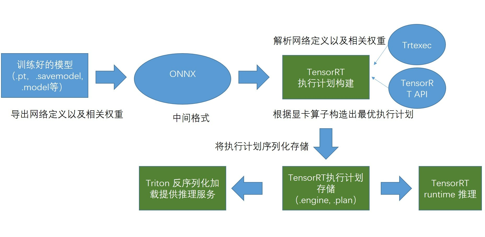

# 模型部署之模型转换流程及质量控制


## 模型转换原理流程
* 导出网络定义以及相关权重；  
* 解析网络定义以及相关权重；  
* 根据显卡算子构造出最优执行计划；  
* 将执行计划序列化存储；  
* 反序列化执行计划；  
* 进行推理；  


## 推理加速技术路线



## 工具

1. PyTorch(.pt)->ONNX(.onnx)[参考](Pytorch%E5%AF%BC%E5%87%BAONNX.md)
```
# torchToOnnx.py
import torch
torch_model = torch.jit.load("/work/wuzihao/ibotModelDeploy/modelTrans/result/vessel/model.pt") # pytorch模型加载
batch_size = 1  #批处理大小
input_shape = (1, 1, 224, 224, 224)   #输入数据

jit_layer = torch_model
print(jit_layer.graph)   # 计算图输出
print(jit_layer.code) 

# set the model to inference mode
torch_model.eval()

x = torch.randn(1, 1, 224, 224, 224)		# 生成张量
export_onnx_file = "../result/vessel/vessel.onnx"					# 目的ONNX文件名
with torch.no_grad(): 
    torch.onnx.export(torch_model, x,
                    export_onnx_file,
                    opset_version=9, 
                    input_names=["INPUT__0"],		# 输入名
                    output_names=["OUTPUT__0"],	    # 输出名
                    dynamic_axes={"INPUT__0":{0:"batch_size"},		# 批处理变量
                                    "OUTPUT__0":{0:"batch_size"}})
```

2. PyTorch算子与ONNX算子的符号函数定义
   ```
    # symbolic.py
    import torch 
    
    class Model(torch.nn.Module): 
        def __init__(self): 
            super().__init__() 
    
        def forward(self, x): 
            return torch.asinh(x) 
    
    from torch.onnx.symbolic_registry import register_op 
    
    def asinh_symbolic(g, input, *, out=None): 
        return g.op("Asinh", input) 
    
    register_op('asinh', asinh_symbolic, '', 9) 
    
    model = Model() 
    input = torch.rand(1, 3, 10, 10) 
    torch.onnx.export(model, input, 'asinh.onnx', opset_version=9) 
   ```
3. [Netron](https://netron.app/)
## 过程保障及结果验证

1. 网络结构可视化
   __Netron__
2. 推理输出误差计算
   ```
    # check.py
    import onnxruntime as ort
    import torch
    from torch import nn
    import numpy as np

    model = torch.jit.load("/work/wuzihao/ibotModelDeploy/ibotModel/pulmonary/0.1/heart/1/model.pt") # pytorch模型加载

    ort_session = ort.InferenceSession('/work/wuzihao/ibotModelDeploy/modelTrans/result/heart/heart.onnx') # onnx模型加载

    input = torch.rand(1, 1, 160, 176, 176)  # 输入初始化

    torch_output = model(input).detach().numpy()   # torch模型输出计算

    ort_output = ort_session.run(None, {ort_session.get_inputs()[0].name: input.numpy()})[0]  # onnx模型输出计算

    print(torch_output.shape)
    print(ort_output.shape)

    print(np.allclose(torch_output, ort_output, rtol=0.0001,atol=0.0009))       # 对接近和相对接近。多个都接近，那么返回接近，绝对忍耐加上相对忍耐
   ```
3. 推理结果可视化
   
   


