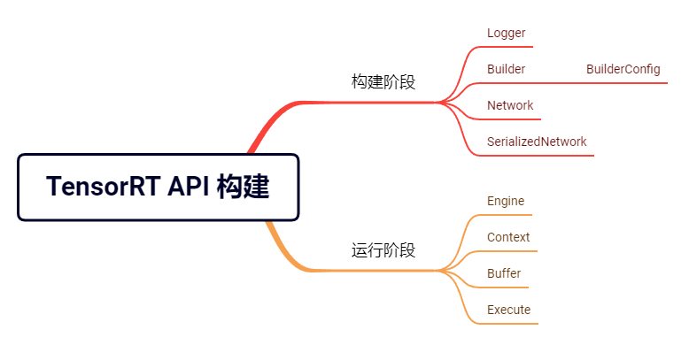

# 模型推理引擎构建之.pt->.engine
* 导出网络定义以及相关权重
* 解析网络定义以及相关权重
* 根据显卡算子构造出最优执行计划
* 将执行计划序列化存储
* 反序列化执行计划
* 进行推理  
__第三步表明tensorrt转换的模型是与硬件绑定的，当cuda和cudnn发生改变，那模型就得重新转换__

## 模型转换方式
1. Tensorrt 接口
使用训练框架自带的TensorRT 接口，如 TF-TRT、Torch-TRT。

2. trtexec工具  
示例：
```
def torch2onnx(model_path,onnx_path):
    model = load_model(model_path)
    test_arr = torch.randn(1,3,32,448)
    input_names = ['input']
    output_names = ['output']
    tr_onnx.export(
        model,
        test_arr,
        onnx_path,
        verbose=False,
        opset_version=11,
        input_names=input_names,
        output_names=output_names,
        dynamic_axes={"input":{3:"width"}}            #动态推理W纬度，若需其他动态纬度可以自行修改，不需要动态推理的话可以注释这行
    )
    print('->>模型转换成功！')
```
执行指令  
> ./trtexec --onnx=repvgg_a1.onnx --saveEngine=repvgg_a1.engine --workspace=1024  --fp16

# 模型推理引擎构建之tensorrt API搭建

TensorRT API 的整个构建过程可以分为构建阶段和运行阶段。  
__构建阶段：__
* 添加算子&数据
* 网络参数配置
* 算子间逻辑连接
* 组建模型网生成 TensorRT Engine  

__运行阶段：__
* 调用构建阶段成的 TensorRT Engine 进行前向推理计算。

__关键模块：__


__C++ API:__  
可以通过头文件NvInfer.h访问，并且位于nvinfer1命名空间中。
```
#include “NvInfer.h”

using namespace nvinfer1;
```

## 基本流程
__构建阶段:__
1. 构建Logger日志记录器  
要创建构建器，首先需要实例化ILogger接口。此示例捕获所有警告消息，但忽略信息性消息：
```
class Logger : public ILogger           
{
    void log(Severity severity, const char* msg) noexcept override
    {
        // suppress info-level messages
        if (severity <= Severity::kWARNING)
            std::cout << msg << std::endl;
    }
} logger;

//创建logger实例
IBuilder* builder = createInferBuilder(logger);
```

2. 创建网络定义  
可使用ONNX模型解析器API进行网络定义填充。

```
uint32_t flag = 1U <<static_cast<uint32_t>(NetworkDefinitionCreationFlag::kEXPLICIT_BATCH);   //32位的无符号整型uinit32

INetworkDefinition* network = builder->createNetworkV2(flag);
IParser*  parser = createParser(*network, logger);  //模型解析器，创建了一个指向IParser类实例对象的指针parser，可访问其成员函数和变量。

//解析onnx模型进行网络定义
parser->parseFromFile(modelFile, 
    static_cast<int32_t>(ILogger::Severity::kWARNING));
for (int32_t i = 0; i < parser.getNbErrors(); ++i)
{
std::cout << parser->getError(i)->desc() << std::endl;
}

```

3. 构建序列化推理引擎
```
IBuilderConfig* config = builder->createBuilderConfig();  //构建配置可以通过设置属性来控制Tensorrt进行网络优化，如maximum workspace size等
// 配置属性设置总全局内存大小
config->setMemoryPoolLimit(MemoryPoolType::kWORKSPACE, 1U << 20);


//引擎构建
IHostMemory*  serializedModel = builder->buildSerializedNetwork(*network, *config);  //序列化引擎

//序列化引擎不能跨平台或 TensorRT 版本移植。引擎特定于构建它们的确切 GPU 模型（除了平台和 TensorRT 版本）。

```

__由onnx模型解析并构建Tensorrt引擎并序列化保存示例：https://www.pudn.com/news/62c920045f75f3409e902dbc.html__


## plugin插件构建
plugin有[官方库](https://github.com/NVIDIA/TensorRT/tree/master/plugin)同时也支持自定义plugin。
要添加自己的算子，可以仿照官方plugin库进行修改添加，将生成的libnvinfer_plugin.so.7替换原本的.so文件即可。或者自己写一个类似于官方plugin的组件，将名称替换一下，同样生成.so，在TensorRT的推理项目中引用这个动态链接库即可。

__具体自定义plugin参考：https://zhuanlan.zhihu.com/p/297002406__
