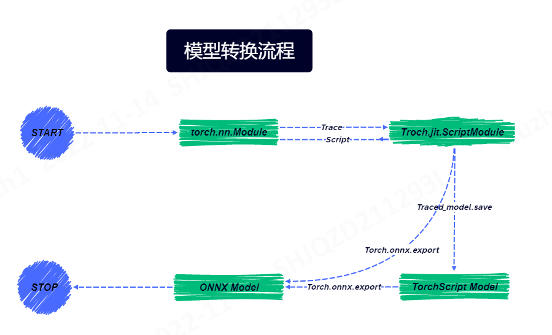
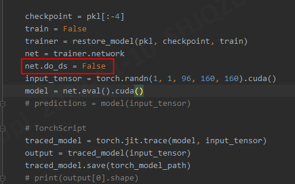

# 模型转化规范流程
目标：构建安全正确的模型转换流程和质量保证
## 整体流程


## TorchScript模型保存
  1. 模型保存
  ```
    # checkpoint load (自定义)
    Model_path = "/DeepLearningExamples-master/PyTorch/Segmentation/nnUNet/results/checkpoints"
    folds='all'
    checkpoint_name = "model_final_checkpoint" 
 
    trainer, params = load_model_and_checkpoint_files(Model_path, folds=folds, mixed_precision=False, checkpoint_name=checkpoint_name)  
    net = trainer.network
   
    checkpoint = torch.load(os.path.join(Model_path , folds, checkpoint_name +".model"))
    net.load_state_dict(checkpoint['state_dict'])
   #--------------------------------------------------------------------------------#
    net.do_ds = False   # 网络定义有多个输出，转模型时要关掉，不然会导致engine构建时内存溢出
    torch_model_path = 'model.pt'   # Torchscript模型保存文件名
    input_tensor = torch.randn(1, 4, 512, 512).cuda()  # 网络输入张量生成
    model = net.eval().cuda()  # 模型设为eval模式，不再进行参数学习更新。
    
    # TorchScript save
    traced_model = torch.jit.trace(model, input_tensor)   # 默认使用Trace，网络结构中如有逻辑判断，使用torch.jit.script()
    output = traced_model(input_tensor)  # 网络输出用于后续校验
    traced_model.save(torch_model_path)
  ```
  2. 质量验证
   * 计算图校验
    [Netron](https://netron.app/)
    使用工具核对计算图、输入输出、权重参数等。[支持导出为SVG]
   * 推理校验
  ```
  原推理结果与TorchScript进行比较。
  ```
## TorchScript模型->ONNX
  1. 模型转换
  ```
    import torch
    torch_model = torch.jit.load("./ibotModelDeploy/modelTrans/tool/model_fine_new.pt") # pytorch模型加载
    input_tensor = torch.randn(1,  1, 96, 160, 160).cuda()		        # 生成输入数据
    export_onnx_file = "./ibotModelDeploy/modelTrans/tool/model_fine_new.onnx"	# 目的ONNX文件名
    batch_size = 1  #批处理大小

    # set the model to inference mode
    torch_model.eval().cuda()

    with torch.no_grad(): 
        torch.onnx.export(torch_model,                 # 加载的pt模型
                        input_tensor,                  # 输入张量
                        export_onnx_file,              # 导出的ONNX文件名
                        opset_version=9,               # onnx算子版本，默认取9
                        input_names=["INPUT__0"],      # 输入节点指定名称，方便后面查看或者操作
                        output_names=["OUTPUT__0"],    # 输出节点指定名称，方便后面查看或者操作
                        dynamic_axes=None              # 是否支持动态维度
                        )
  ```
  
  2. 质量验证
   * 计算图校验
    [Netron](https://netron.app/)
    使用工具核对计算图、输入输出、权重参数等。[支持导出为SVG]
   * 推理校验
    ```
    import onnxruntime as ort
    import torch
    from torch import nn
    import numpy as np

    model = torch.jit.load("/ibotModelDeploy/ibotModel/abdominal/fine_organs/1/model.pt")  # TorchScript模型加载
    ort_session = ort.InferenceSession("/ibotModelDeploy/ibotModel/abdominal/fine_organs/1/fine_organs.onnx")  # ONNX模型加载

    input = torch.rand(1, 1, 96, 160, 160)
    input_torch = torch.tensor(input).cuda()  # 输入随机数初始化

    torch_output = model(input_torch).cpu().detach().numpy()   # TorchScript模型输出
    ort_output = ort_session.run(None, {ort_session.get_inputs()[0].name: input.numpy()})[0]  # onnx模型输出计算

    print(np.mean(torch_output-ort_output))  # 平均误差小于e-3
    ```
## 注意事项和已遇到的ERROR（持续总结）
1. jit不能转换第三方Python库中的函数，尽量所有代码都使用pytorch实现
1. 如果代码中有`if`条件控制，尽量避免使用`torch.jit.trace`来转换代码，因为它不能处理变化条件
1. 多节点输出网络的模型TorchScript导出
   nnUnet:将do_ds设置为false
   
1. while TensorRT does not natively support INT64. Attempting to cast down to INT32
    我们转化后的ONNX模型的参数类型是INT64，然而：TensorRT本身不支持INT64，而对于INT32的精度，TensorRT是支持的，因此可以尝试把ONNX模型的精度改为INT32，然后再进行转换
   ```
    pip install onnx-simplifier
    python -m onnxsim your_model.onnx your_model_sim.onnx

   ```